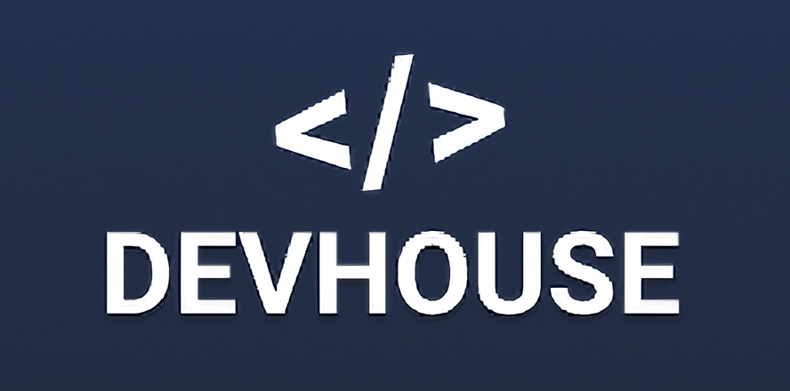

  

  

  
  
  

# This app is not finished yet!!

## :rocket: Technologies

This project was developed with the following technologies:

- Back-End
  - [Node.js](https://nodejs.org/en/)
  - Express.js
  - MongoDB
  - Yup
  - Eslint and Prettier

## 💻 Project

DevHouseApi.

## :memo: License

MIT license. See the file [LICENSE](LICENSE) for more details.

---
